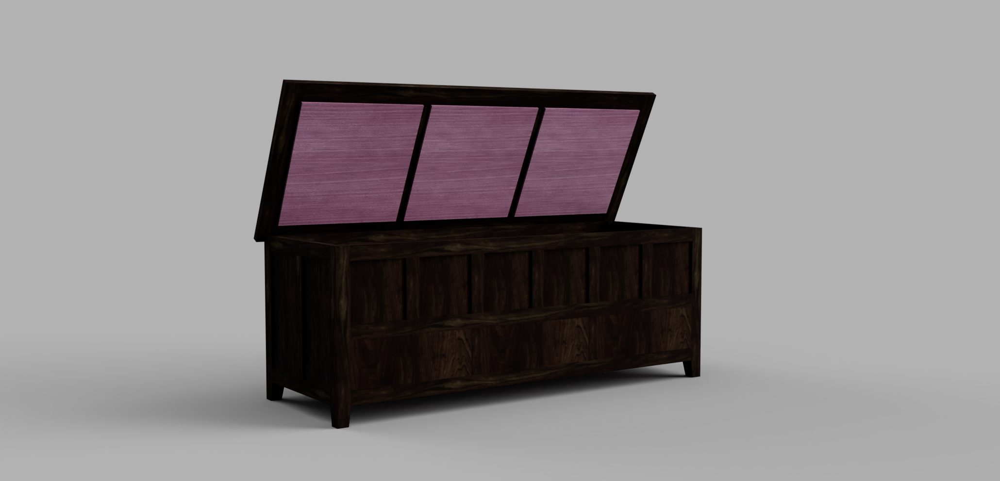

# Blanket Chest, 2021

I have not gotten to build this chest yet but hope to sooner or later. It is a variation on the [Mule Chest](https://www.columbiatribune.com/story/lifestyle/around-town/2011/01/27/origin-mule-chest-stubborn-mystery/21422972007/), with a large top-opening compartment in the top half and three drawers below. It is relatively long (48 in/122 cm) and narrow (18 inches/46 cm) to fit at the end of a king bed without sticking out too far. The height (18 in/46 cm) was chosen to allow it to double as reasonably comfortable seating.

As rendered, the frame is made of walnut and the panels of aromatic cedar veneered on the outside with walnut.